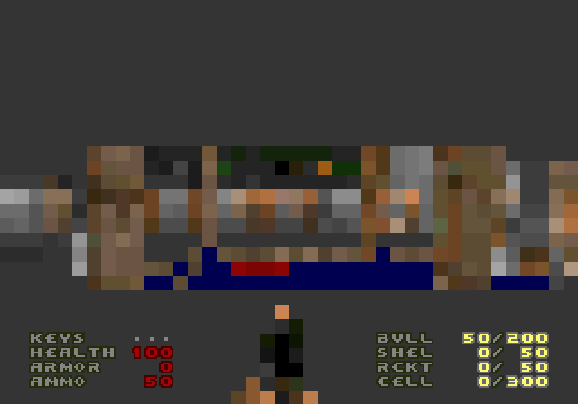
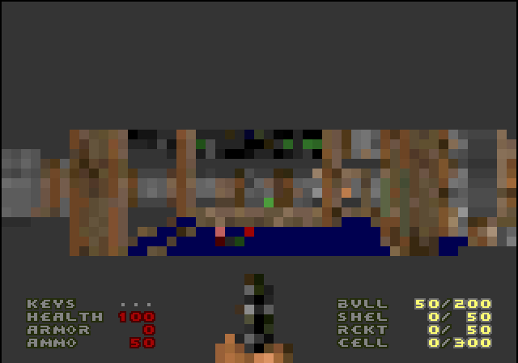
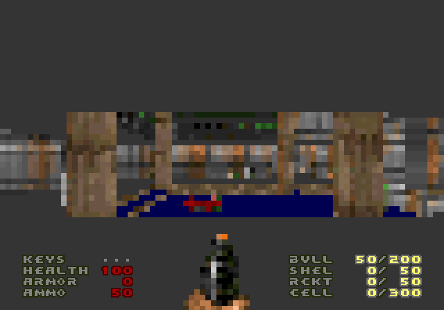
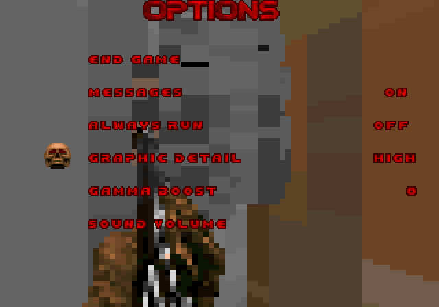
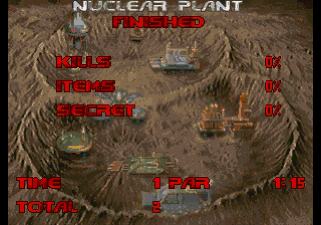

# Doom64KB


Doom64KB is a Doom port for systems with only 64 KB of RAM and ample ROM
space. It is based on [Doom8088](https://github.com/FrenkelS/Doom8088) and
retains Doom's real game simulation, BSP traversal, map geometry, actors, and
WAD-derived assets.

- [Official upstream releases](https://github.com/FrenkelS/Doom64KB/releases)
- [Experimental Neo Geo sprite-renderer releases](https://github.com/sabino/Doom64KB/releases)

## Neo Geo Edition

This fork replaces the Neo Geo FIX gameplay framebuffer with a full-color
sprite microframebuffer. Menus, HUD text, messages, the automap overlay, and
intermission text remain on FIX, where they can appear above a static sprite
background or live gameplay.

### Renderer

At High detail, the CPU renders into a single 4,480-byte, column-major 80x56
logical framebuffer. The C-ROM contains solid-color 16x16 tiles. Neo Geo
hardware shrinking displays those tiles as 4x4, 6x6, or 8x8 cells, expanding
the logical view to the 320x224 screen without storing a full pixel
framebuffer in work RAM.

Sprite pen 0 is transparent. The 256 Doom palette entries are therefore packed
into 18 sprite palettes with 15 visible colors each. Every logical cell
selects both a solid tile and its palette through SCB1.

High detail uses 160 vertical sprite strips per framebuffer set: 80 logical
columns split into two vertical chunks, with only 80 strips active on any
scanline. Two complete sprite-control sets are reserved. The hidden set
receives the next frame's tile and palette attributes, then the sets swap at
VBlank. Synchronous swaps are retained for detail changes, palette changes,
wipes, and static-page transitions.

TITLEPIC, WIMAP0, and HELP2 use dedicated 38x28 sprite-backed backgrounds.
Their 16-palette artwork is generated from the selected IWAD. Menu and
intermission art is rendered on FIX above those backgrounds.

### Graphics Detail

The **Graphic Detail** option changes both Doom's logical render dimensions and
the hardware shrink value. It defaults to High and can be changed before or
during a game.

| Low | Medium | High |
|---|---|---|
|  |  |  |
| 40x28, 8x8 cells | 53x37, 6x6 cells | 80x56, 4x4 cells |

Medium displays a centered 318x222 image. Low and High fill 320x224. Lower
detail reduces wall columns, flat spans, sprite columns, and framebuffer
upload work; it is not merely a display-side stretch.

The selected detail mode is not currently persisted in SRAM.

### Menus And Transitions

| Options menu over live sprite gameplay | Episode intermission |
|---|---|
|  |  |

The menu is a FIX overlay. A user game pauses while its menu is open. Demo
playback continues under the overlay, while gameplay HUD text and messages are
suppressed to avoid competing for FIX cells. Intermission and finale state can
also remain visible below their menu overlay.

The Doom melt captures the visible sprite or static background into the real
16-palette FIX color system, then performs the falling-column wipe on FIX.

### Audio

The Neo Geo build generates a custom Z80 driver and YM2610 audio ROM from the
selected IWAD:

- Six priority-aware ADPCM-A sound-effect channels.
- Mono ADPCM-B music, rendered offline from Doom MUS or Standard MIDI through
  libFluidSynth and a General MIDI SoundFont.
- Separate 0-15 SFX and Music volume controls, persisted in SRAM.
- Music looping handled by the Z80 backend.

The current backend does not implement stereo positioning or distance-based
sound attenuation in hardware.

### Episode 1 Maps And Actors

All nine retail Episode 1 maps are present. E1M1 and E1M8 allocate their map
actor pools directly. E1M2-E1M7 and E1M9 retain map placements in ROM and
stream live actors into RAM:

- Each placement uses a packed 2-bit dormant, active, consumed, or skipped
  state.
- Eligible actors activate within 1024 map units.
- Pristine, unengaged actors may hibernate beyond 1536 map units.
- Streaming updates run every eight game tics.
- Sixteen live slots remain reserved for projectiles and other transient
  actors.
- The player start and teleport destinations remain resident.
- Moved, damaged, or engaged actors do not hibernate.
- Eligible placements still contribute to intermission kill and item totals.

This keeps complete level content available without requiring every monster,
pickup, and decoration to occupy the 64 KB work RAM simultaneously.

## Performance Work

The Neo Geo renderer includes:

- Column-major framebuffer storage and packed strip uploads.
- Unrolled complete framebuffer strip writes.
- Batched four-pixel wall and flat column loops.
- Bounded 68000 `DIVU` paths where the quotient is proven to fit.
- Exact detail-mode projection mappings and cached sky scaling.
- Specialized word multiplies in the wall projection hot path.
- Wall-loop state retained in 68000 registers.
- BSP occlusion short-circuits.
- Chained sprite strips and VBlank control-set swaps.
- Precomposed wall texture columns in ROM.
- Compact sectors, line state, touching-sector nodes, sprite definitions, and
  map geometry references.

Two commit-local deterministic 350-gametic measurements document specific
optimization steps:

| Detail | Before | After | Change |
|---|---:|---:|---:|
| Medium at `b7efa08` | 1608 realtics | 1412 realtics | 12.2% less elapsed time |
| High at `ef3f50f` | 2086 realtics | 1886 realtics | 9.6% less elapsed time, 10.6% more throughput |

These are controlled snapshots for the named commits, not an aggregate
benchmark claim for the current branch. Compact sector references save roughly
1.3 to 4.2 KB of level heap depending on the map, including about 4.2 KB on
E1M6.

## Current Limitations

- Episode 1 only.
- At most 16 prioritized world sprites are selected for one rendered frame.
- Floors and ceilings use flat colors rather than texture mapping.
- Lighting includes sector, wall-orientation, and gamma shading but no
  distance-based light diminishing.
- No save games.
- No multiplayer.
- No positional or stereo SFX.
- Graphic Detail is not persisted.
- The title loop uses the demos embedded by the selected Doom IWAD profile.

## Controls

| Action | Neo Geo |
|---|---|
| Walk | Joystick |
| Fire | B |
| Use / Sprint | A |
| Strafe | C and D |
| Weapon up | A + D |
| Weapon down | A + C |
| Menu | Player 1 Start |
| Automap | Player 2 Start |
| Automap zoom in and out | C and D |
| Automap follow mode | A |

## Cheats

| Effect | Code |
|---|---|
| Chainsaw | C, Up, Up, Left, C, A, A, Up |
| God mode | Up, Up, Down, Down, Left, Right, Left, Right |
| Weapons and Keys | Down, Down, Left, Right, Left, Right, B, A |
| Weapons | D, D, A, D, A, Up, Up, Left |
| No Clipping | Up, Down, Left, Right, Up, Down, Left, Right |
| Invisibility | A, A, A, B, A, A, C, B |
| Radiation suit | B, B, D, Up, A, A, D, B |
| Auto-map | C, A, D, B, A, D, C, Up |
| Light amplification | Down, Left, D, Left, D, C, C, A |
| Toggle FPS counter | A, B, C, Up, Down, B, Left, Left |

## Building The Retail Profile

The Neo Geo build requires:

- [ngdevkit](https://github.com/dciabrin/ngdevkit), including its 68000 and Z80
  toolchains and `romtool.py`.
- Python 3, SoX, `adpcmtool.py`, libFluidSynth, and a General MIDI SoundFont.
- An owned Doom v1.9 registered IWAD named `DOOM64TB.WAD`.
- The checked-in compact `doom64ng.h` and `doommapb.h` data.

```sh
# Build the ROM.
bash bneogeo.sh

# Build and launch with ngdevkit-gngeo.
bash bneogeo.sh -run

# Build the deterministic timedemo variant.
bash bneogeo.sh -timedemo
```

Generated ROM files are written under `neogeo/rom`. `CROM_FILE_BYTES` and
`AUDIO_VROM_BYTES` can override the generated C-ROM and V-ROM sizes for
cartridge-layout experiments.

The GPL source license does not grant permission to redistribute id Software's
commercial game data. A retail-profile ROM is a proprietary-input build and
must not be published with `DOOM.WAD` or a Neo Geo BIOS.

## Building The Shareware Release

The shareware profile is built exclusively from the canonical Doom v1.9
`DOOM1.WAD` (`SHA-256
1d7d43be501e67d927e415e0b8f3e29c3bf33075e859721816f652a526cac771`).
It contains Episode 1 (`E1M1` through `E1M9`) and no registered or Ultimate
Doom data. The main menu includes the original shareware information page
under `READ THIS!`; the PC keyboard-controls page is intentionally omitted.

The repository already contains the compact Neo Geo game and map data. The
builder creates an isolated source stage, installs the shareware IWAD under the
filename expected by the normal build, regenerates sprite/FIX graphics,
palettes, title and intermission backgrounds, wipe data, SFX, and music, then
runs `bneogeo.sh` to build the complete Neo Geo ROM set:

```sh
python3 -B tools/build_shareware_release.py \
  /path/to/DOOM1.WAD \
  --shareware-readme /path/to/README.TXT \
  --output-dir dist/shareware
```

Pass `--keep-work` to retain the isolated build directory for emulator testing.
The release archive contains:

- `doom64kb.zip`: the Neo Geo P/C/S/M/V ROM set.
- `neogeo.xml`: MAME-style ROM metadata.
- `README.txt` and `SOURCE.txt`: profile, controls, and build provenance.
- `LICENSE-GPL.txt`, `BUILD-MANIFEST.json`, and `SHA256SUMS`.
- `DOOM19S-README.TXT` when `--shareware-readme` is supplied.

No Doom IWAD, installer, emulator, or Neo Geo BIOS is included in the release.
Use a compatible user-supplied BIOS or open-source replacement.

## Key Files

| Area | Files |
|---|---|
| Neo Geo renderer and FIX overlay | `i_neogev.c`, `i_neogeo.c` |
| Doom drawing and projection | `r_draw.c`, `r_plane.c`, `r_sky.c` |
| Runtime detail modes | `i_neogev.c`, `r_draw.c`, `r_main.h`, `m_text.c` |
| Map loading and actor streaming | `p_setup.c`, `p_tick.c`, `w_wad.c` |
| Audio backend | `i_audio.c`, `neogeo/sound/doomsnd.s` |
| Neo Geo art generation | `tools/gen_neogeo_fix_menu.py`, `tools/gen_neogeo_color_tiles.py` |
| Audio generation | `tools/gen_neogeo_audio.py` |
| Shareware release pipeline | `tools/build_shareware_release.py` |
| Neo Geo build | `bneogeo.sh` |

## License

Engine source is licensed under GNU GPL version 2. See [LICENSE](LICENSE).
Original Doom data remains subject to id Software's shareware terms. No Neo
Geo BIOS is included.
